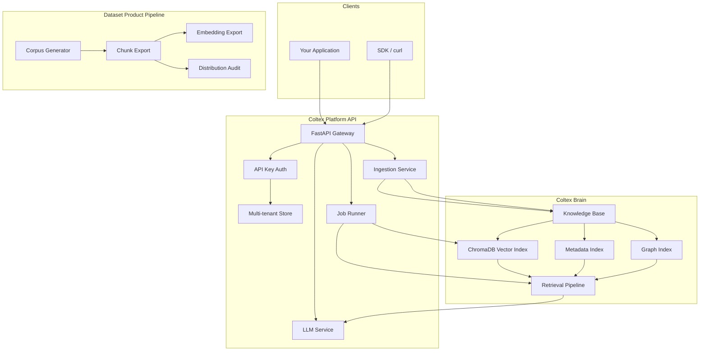

# Coltex Platform Architecture

## System Overview

Coltex RAG-as-a-Service combines a **multi-tenant API layer** with the **Coltex brain** retrieval engine and an optional **premium dataset export pipeline**.



## Component Responsibilities

### Platform API (`coltex_platform/`)

| Module | Role |
|--------|------|
| `app.py` | FastAPI application, lifecycle, DI |
| `store.py` | SQLite persistence (tenants, collections, jobs) |
| `auth.py` | API key verification |
| `services/brain_manager.py` | Per-collection Coltex instances |
| `services/ingestion.py` | Text, URL, file → markdown KB |
| `services/jobs.py` | Background indexing worker |
| `services/llm.py` | RAG chat generation |

### Coltex Brain (`brain/`)

Hybrid retrieval pipeline:
1. Query embedding (MiniLM)
2. Vector search (ChromaDB, cosine HNSW)
3. Metadata keyword matching
4. Graph BFS from frontmatter edges Q
5. Source-weighted reranking
6. Context window assembly

### Dataset Product (`scripts/product/`)

Offline build pipeline producing distributable artifacts with SHA-256 manifest signing and benchmark evidence.

## Multi-Tenancy Model

```
Tenant
 └── Workspace (slug)
      └── Collection (slug)
           ├── kb/          # Markdown documents
           ├── vectors/     # ChromaDB persist dir
           └── documents    # SQLite metadata records
```

Each collection gets an isolated:
- Filesystem knowledge base path
- ChromaDB collection (`coltex_{collection_id}`)
- Cached `Coltex` brain instance

## Data Flow: Ingest → Index → Query

1. **Ingest**: Client uploads content → `IngestionService` writes markdown with YAML frontmatter → `documents` table
2. **Index**: Client POST `/index` → job queued → `BrainManager.index_collection()` rebuilds vectors
3. **Retrieve**: Client POST `/retrieve` → hybrid pipeline → ranked docs + context
4. **Chat**: Client POST `/chat/completions` → retrieve + LLM → answer + citations

## Deployment Topology

### Docker Compose (development / small prod)
- Single `coltex-api` container
- Volume: `coltex-data` for SQLite + tenant KBs

### Kubernetes (production)
- Deployment with 2–20 replicas (HPA)
- PVC for shared tenant data (or per-tenant PVCs at scale)
- LoadBalancer Service on port 80 → 8080

See `deploy/kubernetes/coltex-platform.yaml`.

## Security

- API keys stored as SHA-256 hashes
- Tenant isolation at collection path level
- Tier-based rate limits and quotas
- No cross-tenant collection access (enforced in store queries)

## Scaling Considerations

| Bottleneck | Mitigation |
|------------|------------|
| Embedding CPU | Batch indexing jobs, GPU nodes |
| ChromaDB single-node | Shard collections per tenant; migrate to pgvector |
| SQLite writes | PostgreSQL for metadata at 1000+ tenants |
| LLM latency | Async chat, streaming (roadmap) |

## Observability (Roadmap)

- OpenTelemetry traces on retrieve/chat latency
- Prometheus metrics: `coltex_retrieve_total`, `coltex_index_duration_seconds`
- Structured JSON logging with tenant_id, collection_id
